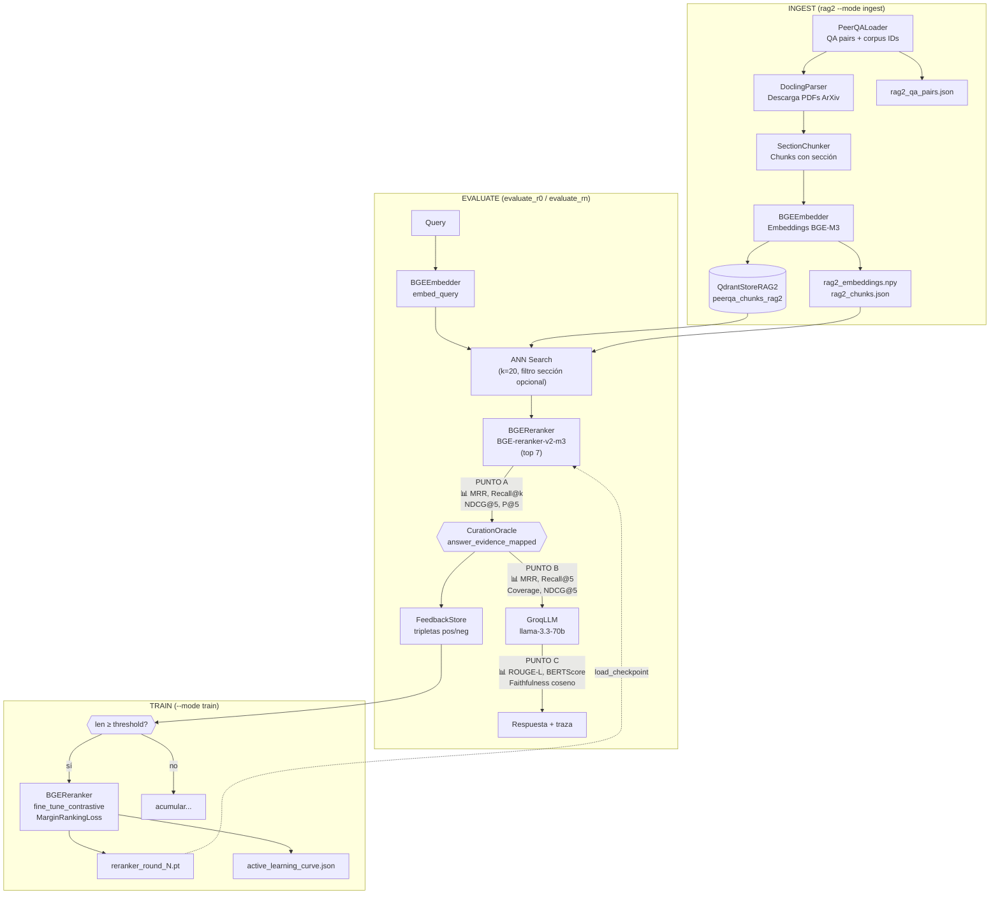
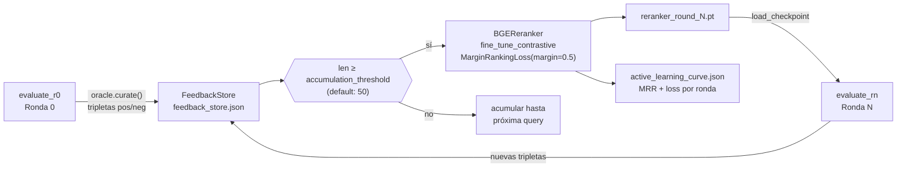

# RAG 2 Architecture — SAIL-RAG con Curación y Aprendizaje Activo

## Pipeline completo con 3 puntos de evaluación



## Tabla comparativa RAG 1 vs RAG 2

| Etapa | RAG 1 (Baseline) | RAG 2 (SAIL) | Por qué cambia |
|---|---|---|---|
| **Ingesta de corpus** | Corpus pre-chunkeado de MTEB | Docling descarga PDFs, preserva secciones | RAG 2 necesita metadato de sección para filtrar y para el oráculo |
| **Chunking** | Ventana deslizante plana (Chunker) | Ventana deslizante con etiqueta de sección (SectionChunker) | La sección es la unidad semántica natural en papers científicos |
| **Vector store** | `peerqa_chunks` (QdrantStore) | `peerqa_chunks_rag2` (QdrantStoreRAG2) | Colección separada con payload de sección; filtrado ANN por sección |
| **Retrieval** | BGE-M3 ANN k=20 → top-5 directo | BGE-M3 ANN k=20 → BGEReranker top-7 | El cross-encoder reordena por relevancia conjunta (query+chunk) |
| **Curación** | No existe | CurationOracle simula decisión humana | SAIL estudia el impacto de la intervención humana en la cadena |
| **Contexto al LLM** | Top-5 chunks del ANN | Solo chunks aprobados por el oráculo | La curación reduce ruido y tokens; fallback si 0 aprobados |
| **Puntos de evaluación** | 2 puntos (A=retrieval, B=post-LLM) | 3 puntos (A=pre-curación, B=post-curación, C=post-LLM) | El Punto B es el corazón del estudio: mide el valor de la curación |
| **Faithfulness** | RAGAS judge (LLM-as-judge, costoso) | Coseno BGE-M3 en CPU (local, determinístico) | RAGAS consume tokens API; coseno es reproducible y gratuito |
| **NDCG** | No disponible | NDCG@5 en Puntos A y B | NDCG penaliza ranking tardío de relevantes; más informativo que Recall solo |
| **Coverage** | No disponible | Fracción ground truth en chunks aprobados | Métrica clave del Punto B: ¿cuánta evidencia sobrevivió la curación? |
| **Aprendizaje activo** | No existe | Fine-tuning contrastivo del reranker | Las decisiones del oráculo mejoran el reranker ronda a ronda |
| **Gestión de VRAM** | BGE-M3 load/unload explícito | BGE-M3 → unload → Reranker → unload → CPU | RTX 3050 4GB no soporta ambos modelos simultáneamente |
| **Token limits** | Stratified sample + judge subset | Misma estrategia + contexto reducido por curación | La curación natural reduce tokens por llamada al LLM |

## Bucle de aprendizaje activo



### Detalle del fine-tuning contrastivo

**Tripleta:** `(query, chunk_aprobado, chunk_rechazado)`

El oráculo genera tripletas donde:
- **Positivo:** chunk que contiene evidencia del `answer_evidence_mapped` (aprobado)
- **Negativo duro:** el mejor chunk rechazado (mayor `rerank_score` entre los no aprobados)

**Pérdida:** `MarginRankingLoss(pos_score, neg_score, margin=0.5)`

El reranker aprende que `score(query, chunk_relevante) > score(query, chunk_irrelevante) + margin`.

**Acumulación:** las tripletas se persisten en `feedback_store.json` para sobrevivir reinicios.

**Umbral:** configurable en `config.yaml` → `rag2.active_learning.accumulation_threshold` (default: 50 tripletas).

## Estructura de archivos generados

```
results/
├── rag1/
│   ├── metrics_post_llm.json
│   └── figures/                    ← 5 figuras RAG 1
├── rag2/
│   ├── round_0/
│   │   ├── metrics_pre_curation.json    ← Punto A
│   │   ├── metrics_post_curation.json   ← Punto B
│   │   ├── metrics_post_llm.json        ← Punto C + todo
│   │   └── figures/                     ← 6 figuras RAG 2 R0
│   └── round_n/
│       ├── metrics_pre_curation.json
│       ├── metrics_post_curation.json
│       ├── metrics_post_llm.json
│       ├── active_learning_curve.json   ← copiado desde checkpoints/
│       └── figures/                     ← 7 figuras RAG 2 RN
└── comparison_rag1_vs_rag2.png          ← generado si existen ambos

checkpoints/
├── rag1_embeddings.npy
├── rag1_chunks.json
├── rag1_qa_pairs.json
├── rag2_embeddings.npy
├── rag2_chunks.json
├── rag2_qa_pairs.json
└── reranker/
    ├── reranker_round_1.pt
    ├── reranker_round_2.pt
    ├── feedback_store.json
    └── active_learning_curve.json
```
