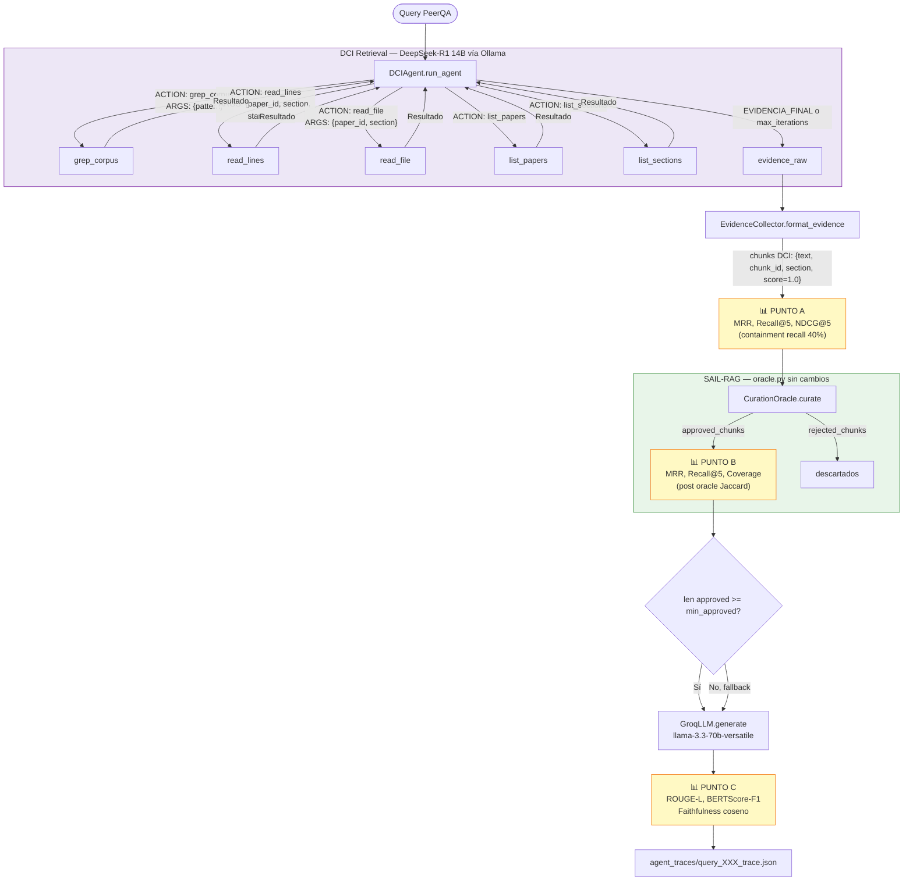

# RAG 3 — DCI + SAIL-RAG: Arquitectura

## Diagrama del pipeline



## Tabla comparativa RAG 1 vs RAG 2 vs RAG 3

| Etapa | RAG 1 (Baseline) | RAG 2 (Reranker+Oracle) | RAG 3 (DCI+Oracle) |
|-------|-----------------|------------------------|-------------------|
| **Retrieval** | BGE-M3 embedding → Qdrant ANN top-20 | BGE-M3 → Qdrant ANN top-20 → BGE-reranker top-7 | DeepSeek-R1 agente: grep/read iterativo sobre corpus .txt |
| **Curación** | ❌ sin curación | ✅ Oráculo SAIL-RAG (Jaccard 0.75) | ✅ **MISMO** oráculo SAIL-RAG |
| **Generación** | Groq llama-3.3-70b | Groq llama-3.3-70b | Groq llama-3.3-70b |
| **Judge** | Groq | Groq | Groq |
| **Corpus** | Chunks Qdrant (vectores) | Chunks Qdrant + secciones | Archivos .txt por sección |
| **Iteraciones** | 1 (one-shot) | 1 (one-shot) | 1–5 (iterativo) |
| **VRAM** | BGE-M3 en GPU | BGE-M3 + reranker en GPU | DeepSeek-R1 en GPU vía Ollama |
| **Métrica Point A** | Exacto por chunk_id | Exacto por chunk_id | Containment recall 40% |
| **Dependencia externa** | Qdrant | Qdrant | Ollama |

### Qué cambia en cada etapa

- **RAG 1 → RAG 2**: Se agrega reranker cruzado (BGE-reranker-v2-m3) + oráculo de curación SAIL-RAG + aprendizaje activo. El retrieval base (BGE-M3 + Qdrant) es idéntico.
- **RAG 2 → RAG 3**: El retrieval completo (vectorial + reranker) se reemplaza por el agente DCI. El oráculo, el LLM de generación y las métricas de Punto B y C son idénticos.
- **RAG 1 → RAG 3**: Cambio total de retrieval (vectorial → agéntico) Y adición de curación. Compara el peor caso (sin curación, vectorial) contra DCI+curación.

## Loop ReAct: DeepSeek-R1 como agente

### Por qué ReAct sin framework

El loop ReAct está implementado manualmente (un bucle `for` con historial de mensajes) sin depender de LangChain, LlamaIndex ni similares. Esto garantiza:
1. **Reproducibilidad**: el mismo código produce el mismo resultado dado la misma semilla.
2. **Auditabilidad**: los bloques `<think>` son accesibles y se guardan en el trace JSON.
3. **Control de timeout**: un timeout de 120s por llamada evita que el pipeline se bloquee.

### Por qué DeepSeek-R1 para retrieval pero Groq para generación

DeepSeek-R1 es un modelo razonador que emite `<think>...</think>` antes de actuar. Esta capacidad es ideal para **navegar** un corpus textual iterativamente — el modelo razona sobre qué buscar a continuación basándose en los resultados previos.

Sin embargo, DeepSeek-R1 corre en Ollama (local, RTX A5000) y su temperatura está fijada en 0.0 para determinismo. Para la **generación final** se usa Groq (llama-3.3-70b-versatile) porque:
- Es el mismo modelo en RAG 1 y RAG 2, garantizando comparabilidad.
- Groq corre en la nube y no compite por VRAM.
- La tarea de generación (resumir contexto dado) no requiere razonamiento iterativo.

### Protocolo de herramientas

El agente usa el formato estructurado `ACTION: / ARGS: {}` que es parseado con regex:

```
<think>
Necesito buscar el término exacto de la métrica mencionada en la pregunta...
</think>

ACTION: grep_corpus
ARGS: {"pattern": "F1-score", "section_filter": "results"}
```

Cada herramienta retorna un string que el agente lee como siguiente observación. El loop termina cuando el agente emite `EVIDENCIA_FINAL:` o cuando se alcanza `max_iterations`.

## Equivalencia de comparación entre los 3 sistemas

Para que la comparación sea válida, los siguientes elementos son **idénticos** en los 3 RAGs:

| Elemento | Valor común |
|----------|------------|
| LLM generador | `llama-3.3-70b-versatile` vía Groq |
| LLM juez | `llama-3.3-70b-versatile` vía Groq |
| Dataset | `mteb/PeerQA` (corpus + queries + qrels) |
| Subset de evaluación | 200 queries, semilla 42, muestreo estratificado |
| Oráculo de curación | `oracle.py` con Jaccard ≥ 0.75 (RAG 2 y RAG 3) |
| Métricas Punto C | ROUGE-L, BERTScore-F1, faithfulness coseno |

Lo que **varía** entre RAGs:

| Etapa | Diferencia |
|-------|-----------|
| Retrieval | Vectorial one-shot vs agéntico iterativo |
| Curación | Ausente (RAG 1) vs oráculo SAIL-RAG (RAG 2, RAG 3) |
| Corpus | Chunks Qdrant vs archivos .txt por sección |
| Métrica Point A | Exacta por chunk_id vs containment recall |

## Notas de implementación

### Métricas en Punto A para DCI

Los chunks DCI tienen IDs como `dci_paper001_results_0001` que no corresponden a los corpus IDs de PeerQA (e.g., `nlpeer/F1000-22/10-170_5`). Por eso se usa **containment recall** (40%): un chunk es relevante si al menos el 40% de las palabras de algún pasaje del ground truth aparecen en él. Esto es más apropiado que Jaccard simétrico cuando el chunk es una sección completa que contiene el pasaje corto del ground truth.

### Oracle con chunks DCI

El oráculo `CurationOracle` usa Jaccard 0.75 por defecto. Para los chunks DCI:
- **Match por ID**: falla (IDs distintos).
- **Match Jaccard**: puede funcionar si el chunk DCI es un fragmento pequeño similar al pasaje ground truth. Los chunks generados por `read_lines` (ventanas de ~10 líneas) tienen más posibilidades de alcanzar el umbral que las secciones completas de `read_file`.

El EvidenceCollector divide los textos largos de `read_file` en sub-chunks de ~300 palabras para mejorar la probabilidad de match Jaccard.

### Estructura del corpus

```
corpus/
  nlpeer_F1000-22_10-170/   ← paper_id saneado (/ → _)
    abstract.txt
    introduction.txt
    results.txt
    discussion.txt
  nlpeer_F1000-22_10-171/
    ...
```

Los paper_ids son saneados porque los IDs de PeerQA contienen `/` que no puede usarse en nombres de directorio.
